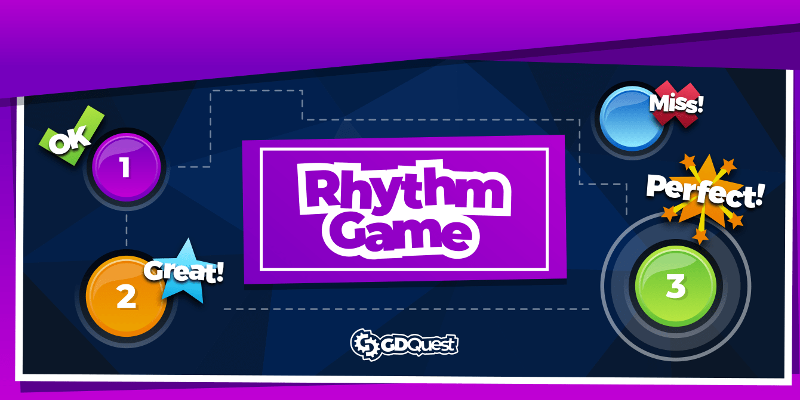
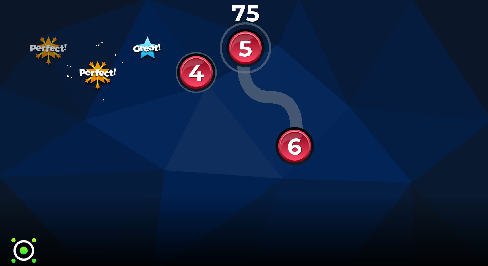
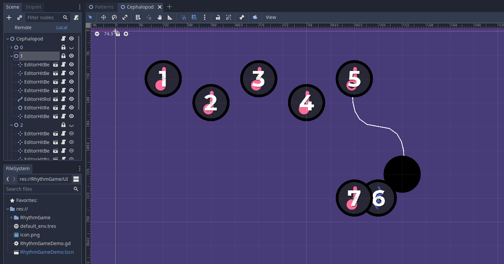

# Godot 2D Rhythm Game

This demo is a rhythm game designed for the course [Godot 2D Secrets](https://www.kickstarter.com/projects/gdquest/godot-2d-secrets-level-up-your-game-creation-skills).

It has three demo tracks to play: **Cephalopod**, **Disco Lounge** and **Werq**. These tracks are by [Kevin MacLeod](https://incompetech.com/).

## Editing beat patterns

Edit tracks by using its `.tscn` scene. You can find them in `res://RhythmGame/Tracks`. Each pattern should add up to 8 whole beats (or 16 half beats), including rests.

➡ Follow us on [Twitter](https://twitter.com/NathanGDQuest) and [YouTube](https://www.youtube.com/c/gdquest/) for free game creation tutorials, tips, and news!
